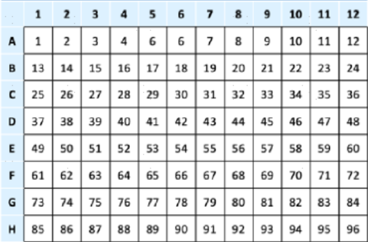

## **Usage**  

### **1. Prepare the RNA genome directory**  
Refer to the [RNA assay guide](multi_rna.md) for details.  

### **2. Generate scripts for each sample**  
In your working directory, create a shell script named `run.sh` with the following content:  

```bash
multi_bulk_rna \
    --mapfile ./rna.mapfile \
    --genomeDir {path to hs_ensembl_99 or mmu_ensembl_99} \
    --well_sample well_sample.tsv \
    --thread 16 \
    --mod shell
```  

#### **Parameter Descriptions:**  
- `--mapfile` (**Required**): A tab-delimited text file with at least three columns, where each row represents a paired-end FASTQ file entry.  

  **Column structure:**  
  1st column: FASTQ file prefix  
  2nd column: Directory path containing the FASTQ files  
  3rd column: sample name of the whole library(used as the prefix for output matrix file)  

  **Example:**  
  Sample1 has two paired-end FASTQ files located in different directories (`fastq_dir1` and `fastq_dir2`), while Sample2 has one paired-end FASTQ file in `fastq_dir1`.  

  ```bash
  $ cat ./my.mapfile
  fastq_prefix1  fastq_dir1  sample1
  fastq_prefix2  fastq_dir2  sample1
  fastq_prefix3  fastq_dir1  sample2

  $ ls fastq_dir1
  fastq_prefix1_1.fq.gz  fastq_prefix1_2.fq.gz
  fastq_prefix3_1.fq.gz  fastq_prefix3_2.fq.gz

  $ ls fastq_dir2
  fastq_prefix2_1.fq.gz  fastq_prefix2_2.fq.gz
  ```  

- `--genomeDir` (**Required**): Path to the genome directory created using `celescope rna mkref`.  

- `--well_sample` (**Required**): A TSV file containing well numbers and sample names of wells.  

  **Column structure:**   
    1st column: Well numbers  
    2nd column: Corresponding sample names

  **96 well number(8 * 12)**
  
  

  **384 well number(16 * 24), only used in `bulk_rna-V1`**
  
  **Example:**
  ```tsv
  1 control1
  2 control2
  3 treatment1
  4 treatment2
  ...
  ```

- `--thread`: Number of threads to use (maximum: 20).  
- `--mod`: Specifies the script format:  
  - `shell` bash script
  - `sjm` (for [Simple Job Manager](https://github.com/StanfordBioinformatics/SJM))  

### **3. Run the analysis**  
After executing `sh run.sh`, a `shell/` directory will be created, containing `{sample}.sh` scripts.  

Start the analysis by running:  
```bash
sh ./shell/{sample}.sh
```  
> **Note:** The `{sample}.sh` script must be executed from the working directory, not from inside the `shell/` directory.  

---

## **Main Output Files**  

- `outs/*_matrix.tsv.gz`  
  - Gene expression UMI matrix, where rows represent gene IDs and columns correspond to samples.

- `02.split_fastq/{sample}_fq.gz`  
  - R2 FASTQ files split based on well barcodes. The UMI sequence is appended to the read name, separated by a colon.


