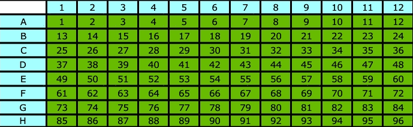

## Usage

### 1. Prepare the RNA genome directory

Refer to the [RNA assay guide](multi_rna.md) for details.

---

### 2. Generate scripts for each sample

In your working directory, create a shell script named `run.sh`:

```bash
multi_bulk_rna \
  --mapfile ./rna.mapfile \
  --genomeDir {path to hs_ensembl_110 or mmu_ensembl_110} \
  --well_sample well_sample.tsv \
  --thread 16 \
  --mod shell
```

Optional: Add `--split_fastq` and/or `--split_bam` if you want to split the FASTQ/BAM for each well.

#### Arguments

`--mapfile`
Required. The mapfile is a tab-delimited text file containing at least three columns. Each line represents one pair of FASTQ files.

* 1st column: FASTQ file prefix
* 2nd column: FASTQ file directory path
* 3rd column: Sample name, which is the prefix of all output files

Example:


```bash
$ cat ./my.mapfile
fastq_prefix1	fastq_dir1	sample1

$ ls fastq_dir1
fastq_prefix1_R1.fq.gz	fastq_prefix1_R2.fq.gz
```

`--genomeDir`
Required. The path to the genome directory generated by `celescope rna mkref`.

`--well_sample`
Required. A TSV file containing well numbers and sample names of wells.

* 1st column: Well numbers
* 2nd column: Corresponding sample names

**96 well number (8 × 12)**



**384 well number (16 × 24), only used in `bulk_rna-V1`**

Example:

```tsv
1	control1
2	control2
3	treatment1
4	treatment2
...
```

`--chemistry`
Chemistry version. Available choices:

| Chemistry | Pattern | Description |
|-----------|---------|-------------|
| `bulk_rna-V1` | C9U12 | 384-well format |
| `bulk_rna-V2` | L9C9U12 | |
| `bulk_rna-V3` | C6U16 | |
| `bulk_rna-bulk_vdj_match` | L18C6U16 | Matched with bulk_vdj |

Default is `auto`, which automatically detects the chemistry from the FASTQ files.

`--thread`
The recommended number of threads is 16. Using more than 20 threads is generally not recommended, because [the mapping speed of STAR tends to saturate above approximately 20 threads](https://github.com/singleron-RD/CeleScope/issues/197).

`--mod`
Specifies the script type to generate. Available options include `sjm`, which uses [Simple Job Manager](https://github.com/StanfordBioinformatics/SJM), and `shell`, which generates standard shell scripts.

`--split_fastq`
Split FASTQ file according to well barcodes. Appends UMI to read name with UMI separator `:`.

`--split_bam`
Split BAM file according to well barcodes.

After running:

```bash
sh run.sh
```

a `shell` directory containing `{sample}.sh` files will be generated.

Start the analysis by running:

```bash
bash ./shell/{sample}.sh
```

Please note that `./shell/{sample}.sh` must be executed from the working directory. It should not be run from inside the `shell` directory.

---

## Main output

- `outs/{sample}_matrix.tsv.gz`
  Gene expression UMI count matrix in TSV format (tab-separated values), compressed with gzip.

  **Structure:**
  * **Rows**: Gene IDs (e.g., `ENSG00000223972`)
  * **Columns**: Sample names as defined in the `--well_sample` file (e.g., `control1`, `treatment1`)
  * **Values**: UMI (Unique Molecular Identifier) counts — the number of unique transcript molecules detected for each gene in each sample

  **Example:**

  ```tsv
    control1	control2	treatment1	treatment2
  ENSG00000223972	12	8	15	10
  ENSG00000227232	0	5	3	7
  ENSG00000278267	45	38	52	41
  ```

  **Notes:**
  * The matrix is generated by collapsing raw reads to UMI counts, which removes PCR duplicates.
  * Only wells (barcodes) present in the `--well_sample` file are included; barcodes are converted to sample names.
