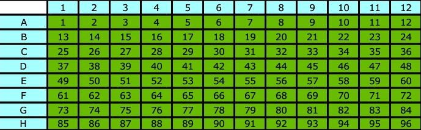

## Usage
1. Make a vdj reference

### Homo sapiens

```
mkdir -p /genome/vdj/human
cd /genome/vdj/human
wget https://www.imgt.org/download/V-QUEST/IMGT_V-QUEST_reference_directory/Homo_sapiens/TR/TR{A,B}{V,J}.fasta
wget https://www.imgt.org/download/V-QUEST/IMGT_V-QUEST_reference_directory/Homo_sapiens/TR/TRBD.fasta
wget https://www.imgt.org/download/V-QUEST/IMGT_V-QUEST_reference_directory/Homo_sapiens/IG/IG{H,K,L}{V,J}.fasta
wget https://www.imgt.org/download/V-QUEST/IMGT_V-QUEST_reference_directory/Homo_sapiens/IG/IGHD.fasta
celescope vdj mkref human TR
celescope vdj mkref human IG
```

### Mus musculus

```
mkdir -p /genome/vdj/mouse
cd /genome/vdj/mouse
wget https://www.imgt.org/download/V-QUEST/IMGT_V-QUEST_reference_directory/Mus_musculus/TR/TR{A,B}{V,J}.fasta
wget https://www.imgt.org/download/V-QUEST/IMGT_V-QUEST_reference_directory/Mus_musculus/TR/TRBD.fasta
wget https://www.imgt.org/download/V-QUEST/IMGT_V-QUEST_reference_directory/Mus_musculus/IG/IG{H,K,L}{V,J}.fasta
wget https://www.imgt.org/download/V-QUEST/IMGT_V-QUEST_reference_directory/Mus_musculus/IG/IGHD.fasta
celescope vdj mkref mouse TR
celescope vdj mkref mouse IG
```

2. Generate scripts for each sample

Under your working directory, write a shell script `run.sh` as

```
multi_bulk_vdj \
    --mapfile ./vdj.mapfile \
    --ref_path {path to Homo sapiens or Mus musculus} \
    --species {human or mouse} \
    --type TCR \
    --well_sample well_sample.tsv \
    --mod shell
``` 
`--mapfile` Required.  Mapfile is a tab-delimited text file with three columns. Each line of mapfile represents paired-end fastq files.

1st column: Fastq file prefix.  
2nd column: Fastq file directory path.  
3rd column: Sample name, which is the prefix of all output files.  

Example

Sample1 has 2 paired-end fastq files located in 2 different directories(fastq_dir1 and fastq_dir2). Sample2 has 1 paired-end fastq file located in fastq_dir1.
```
$cat ./my.mapfile
fastq_prefix1	fastq_dir1	sample1
fastq_prefix2	fastq_dir2	sample1
fastq_prefix3	fastq_dir1	sample2

$ls fastq_dir1
fastq_prefix1_1.fq.gz	fastq_prefix1_2.fq.gz
fastq_prefix3_1.fq.gz	fastq_prefix3_2.fq.gz

$ls fastq_dir2
fastq_prefix2_1.fq.gz	fastq_prefix2_2.fq.gz
```

`--ref_path` Required. The path of the reference directory after running `celescope vdj mkref`.

`--species` Required. Human or Mouse.

`--type` Required. TCR or BCR.

`--well_sample` (Required): A TSV file containing well numbers and sample names of wells.  

  Column structure:   
    1st column: Well numbers  
    2nd column: Corresponding sample names

  96 well number(8 * 12)
  
  
  
  Example:
  ```tsv
  1 control1
  2 control2
  3 treatment1
  4 treatment2
  ...
  ```

`--mod` Create `sjm`(simple job manager https://github.com/StanfordBioinformatics/SJM) or `shell` scripts. 

After you `sh run.sh`, a `shell` directory containing `{sample}.sh` files will be generated.

3. Start the analysis by running:
```
bash ./shell/{sample}.sh
```
Note that the `./shell/{sample}.sh` must be run under the working directory(You shouldn't run them under the `shell` directory)

## Main output

- `outs/annotation` This directory contains V(D)J annotations for each well/sample. This directory can be imported into [immunarch](https://github.com/immunomind/immunarch) for downstream analysis using the following code:

```r
library(immunarch)
immdata <- repLoad("path to outs/annotation")
```

* `outs/clonotypes` This directory contains clonotype information for each well/sample, aggregated based on `cdr3` amino acid sequence.

* `outs/{sample}_filtered_annotations.csv` contains combined V(D)J annotations across all wells/samples.

* `outs/{sample}_clonotypes.csv` contains combined clonotype information across all wells/samples.

